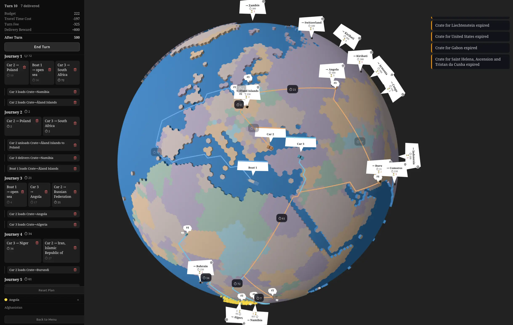

# global-delivery-3js



Turn-based logistics game on a 3D globe. Each turn you plan vehicle routes and cargo operations, confirm, watch them execute, then repeat until your time budget runs out.

## Running

```bash
npm install
npm run dev       # dev server with HMR
npm run build     # tsc + vite → dist/
npm run preview   # serve dist/ locally
npm run lint      # eslint src/
```

`vite.config.ts` sets `base: './'` so the build can be deployed to itch.io or any static host without a root path.

## Tech stack

- **Three.js** — 3D globe rendering, GLB vehicle/crate meshes
- **XState** — game flow state machine, input mode state machine
- **Vite + TypeScript** — build tooling, path alias `@/` → `src/`
- **Pragmatic drag-and-drop** — crate load/unload drag interactions
- **@use-gesture/vanilla** — canvas pan/pinch camera control

---

## Architecture

### Data flow

```
plan (source of truth)
  └─ derivePlanState(plan, navApi, tileApi) → DerivedPlanState
       └─ deriveRouteLegs(derived) → route legs for HUD
       └─ deriveTurnEconomy(gameState, plan, derived) → budget numbers
            └─ sync: labels, renderer, panels, HUD
```

Everything is re-derived from scratch on every mutation. There is no incremental update.

### Source of truth: `Plan`

```
src/model/types/Plan.ts
```

```ts
interface Plan {
  vehicles: Record<number, Vehicle>
  crates: Record<number, Crate>
  initialState: InitialState          // positions before any step runs
  steps: PlanStep[]                   // ordered sequence of intents
}

type PlanStep = JourneyStep | CargoStep

interface JourneyStep {
  kind: 'JOURNEY'
  journeys: JourneyIntent[]           // one per vehicle max; vehicle → destination tile
}

interface CargoStep {
  kind: 'CARGO'
  action: CargoIntent                 // LOAD | UNLOAD | DELIVER
}
```

`DELIVER` is a special `UNLOAD` that counts as a successful delivery (awards stamps/reward).

### Derived state: `DerivedPlanState`

```
src/model/types/DerivedPlanState.ts
src/controller/plan_deriver.ts
```

Computed by `derivePlanState()`. Never mutated directly.

- `initialSnapshot` — world state before any steps
- `stepSnapshots[i]` — world state after `plan.steps[i]`
- `steps` — derived counterpart to each plan step; journeys include computed path and traveltime
- `deliveredCrates` — set of crateIds successfully delivered so far
- `occupiedTiles` — all tiles ever used across the plan; used to validate new placements
- `totalTraveltime` — sum across all journeys (used by turn economy)

### Plan mutation: `PlanIntentManager`

```
src/controller/plan_intent_manager.ts
```

All mutations go through this class. It does not propagate — callers must call `rerender()` after. Key methods:

- `addJourneyToEarliestStep(vehicleId, toTileId)` — appends or merges into the earliest available journey step
- `addCargoIntentAfterJourneyStep(stepIndex, intent)` — inserts a cargo step after a given journey step
- `pruneAndMerge()` — collapses empty steps, merges consecutive journey steps

Undo/redo wraps mutation calls with `structuredClone` snapshots (`src/controller/undo_redo.ts`).

### Navigation

```
src/controller/navigation.ts
src/model/db/nav/   ← pre-computed JSON navmeshes
```

`NavApi` loads three adjacency graphs from pre-built JSON:

| Mesh | Coverage |
|------|----------|
| `LAND` | land tiles only |
| `WATER` | water tiles only |
| `ALL` | both |

Each graph includes connected components. `findPath()` runs BFS. `getLargestComponentNodeIds()` is used for spawn placement to ensure reachability.

### Turn economy

```
src/controller/turn_economy.ts
```

Each turn: `budget - travelCost - turnFee + reward`. `turnFee` scales as `100 + 25 * turnNumber`. Delivering a crate awards its `rewardTimecost`. Budget going negative ends the game.

### Game flow

```
src/controller/game_flow/game_flow_machine.ts   ← XState machine
src/controller/game_flow/game_flow_controller.ts ← orchestrator
```

States:

```
MAIN_MENU → CARD_PICK → PLAN ⇄ ANIMATE → GAME_OVER → CARD_PICK
```

- **CARD_PICK** — player picks 3 resource cards (GET_CAR, GET_BOAT, GET_TIME, GET_CRATE); starting hand is always `[GET_BOAT, GET_CAR, GET_CAR]`
- **PLAN** — player places vehicles/crates, draws routes, assigns cargo ops; HUD + plan panel + inspector panel are visible
- **ANIMATE** — `PlanAnimator` sequences step animations tick-by-tick; `AnimateRenderer` manages moveable meshes; plan UI is hidden
- **GAME_OVER** — shown when `afterTurn < 0`

### Input modes

```
src/controller/input_mode/input_mode_machine.ts
```

XState machine tracking what the player is currently doing: idle, placing a vehicle, drawing a route, loading a crate, etc. UI reacts via `subscribeInputModeUI`.

### Rendering

```
src/view/game/game_item_renderer.ts   — static plan objects (pins, crates, vehicles)
src/view/game/animate_renderer.ts     — moveable meshes during ANIMATE
src/view/game/label_renderer.ts       — CSS2D labels for crates and vehicles
src/view/game/globe_scene.ts          — Three.js scene, lighting, globe mesh
src/view/camera/main_camera.ts        — orbit camera with gesture control
```

`game_item_renderer` re-syncs on every `rerender()`. `animate_renderer` is only active during ANIMATE state.

### UI panels

```
src/view/ui/hud_panel/hud_panel.ts          — top bar: budget, turn, stamps
src/view/ui/plan_panel/plan_panel.ts        — left Gantt sidebar: step list
src/view/ui/inspector_panel/inspector_panel.ts — right sidebar: selected entity detail
src/view/ui/screens/                        — full-screen overlays (MainMenu, CardPick, GameOver)
```

All panels sit below the 48px HUD (`top: 48px`).

### App.ts

```
src/app/App.ts
```

Thin orchestration layer. Wires callbacks between systems, drives the render loop, exposes `enterAnimateMode()` / `advancePlanToNextTurn()` / `hidePlanUI()` / `showPlanUI()`. **No game logic lives here.**

### Tile data

```
src/controller/layer_0/tile_centers_api.ts
```

~40 000 tiles covering the globe. Each tile has: `tileId`, lat/lon center, land/water flag, country code. Used by navmesh lookup and crate spawning.

---

## Key invariants

- `plan` is the only mutable source of truth. `DerivedPlanState` is always a pure function of `plan`.
- `rerender()` is called after every mutation and rebuilds all derived state from scratch.
- Tile IDs are stable integer keys; all Maps and Records key on them.
- `occupiedTiles` must be checked before placing any new vehicle or crate.
- Navmesh BFS returns `null` (not an empty array) when a path does not exist.
